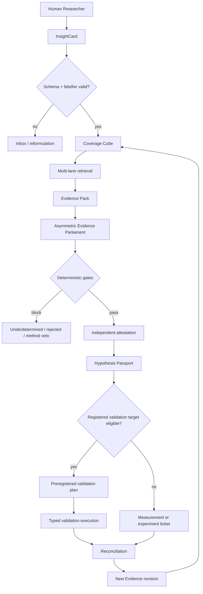
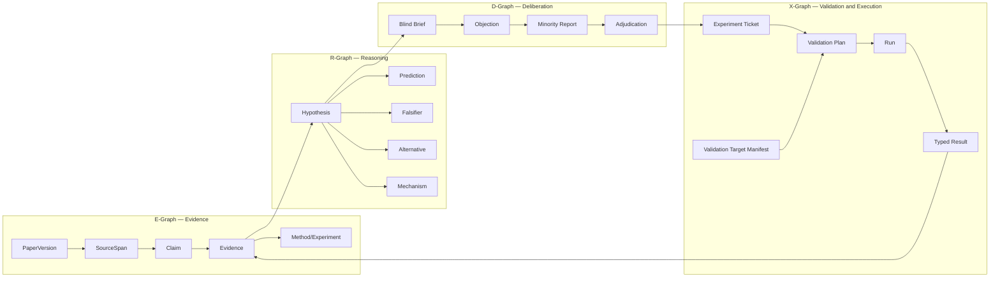
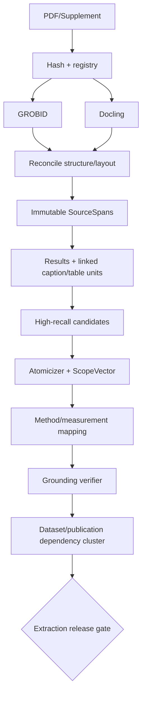
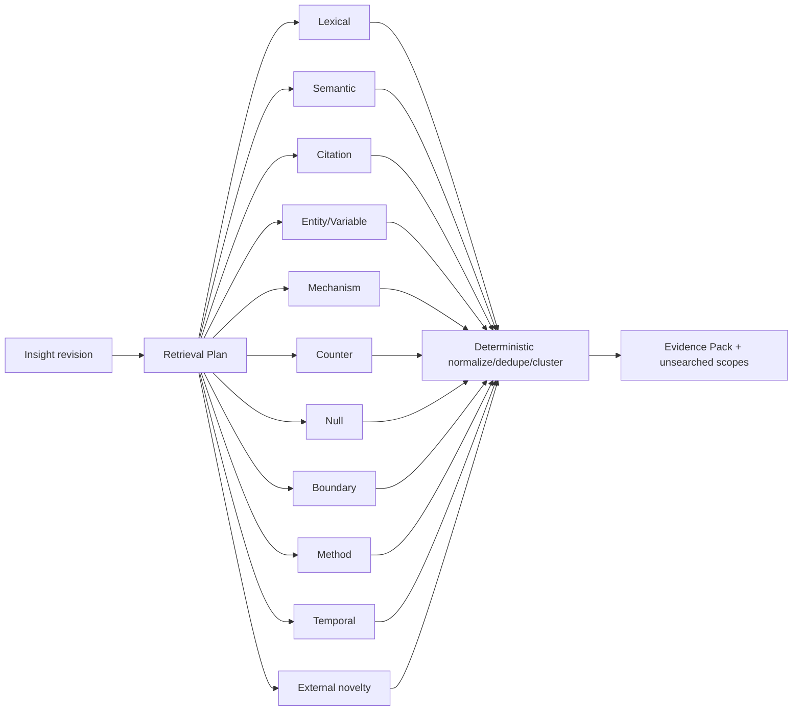
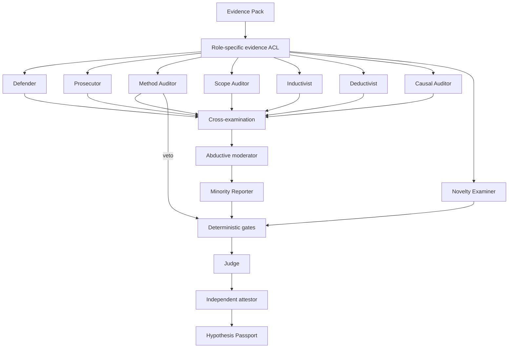
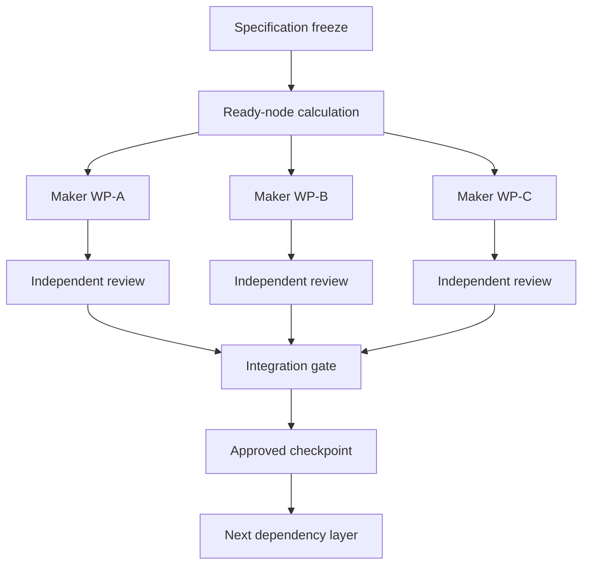
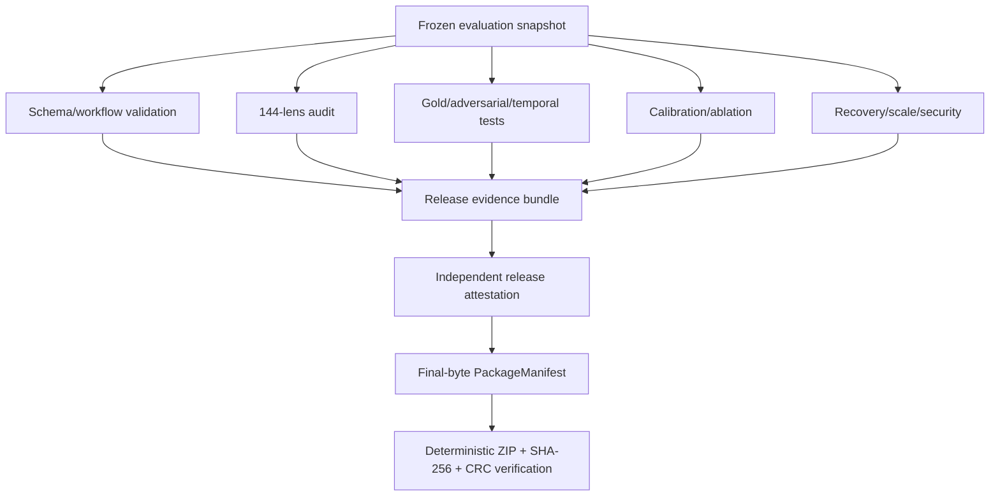

# Architecture Diagrams

## 1. Product loop

## 2. Four-Graph

## 3. Ingest and extraction

## 4. Evidence retrieval lanes

## 5. Parliament

## 6. Development graph

## 7. Update and reassessment

```mermaid
flowchart LR
    U[Source / policy / schema update] --> IR[UpdateImpactReport]
    IR --> ST[Mark downstream stale]
    ST --> RP[Reassessment plan]
    RP --> ING[Targeted ingest]
    ING --> CL[Targeted Claim Forge]
    CL --> RET[Targeted retrieval]
    RET --> PAR[New Parliament run]
    PAR --> DELTA[Decision delta]
    DELTA --> SUP[Supersession events]
    SUP --> N[Notifications]
```

## 8. Release assurance

